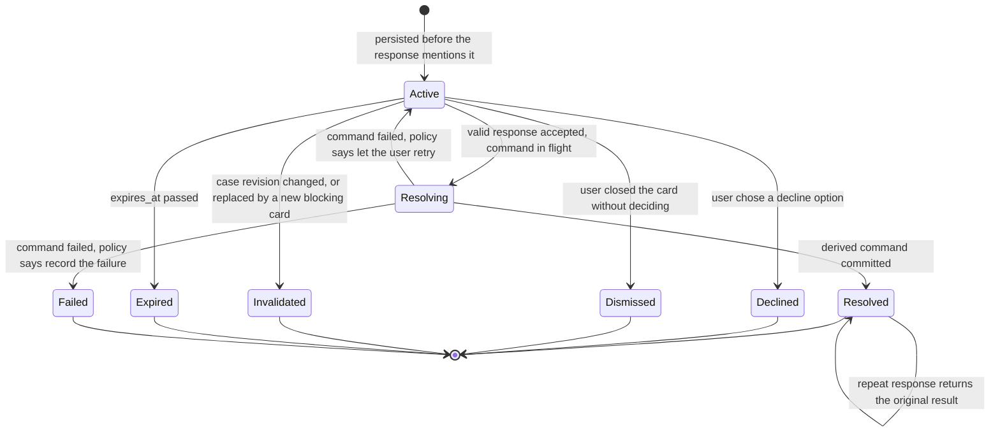

# Persistent interactions

An **Interaction** is Turnframe's durable record of a decision the user has been asked to make: a confirmation button, a yes/no question, a "which traveler did you mean?" picker, a review screen before a send. Cards are not model tool calls and they are not rendered on the fly by the client; they are rows that the runtime writes before it mentions them and consults again when the user answers. This guide covers the lifecycle, the kinds, how options and their meaning are stored, how revisions bind and invalidate cards, the one-blocking-interaction rule, text resolution, the coexistence of text and click in a single turn, what the client is allowed to send, and the error outcomes.

The normative source is the master spec (§9, §15, invariants I5, I6, I7) and ADR-004. This document explains; it does not override.

## Why interactions are persistent

Turnframe's promise is that models propose meaning, deterministic reducers decide effects, and committed events decide claims. An interaction is where the user's decision enters that chain, so it has to be as trustworthy as the events it authorizes. Three consequences follow:

- **The card exists before it is described.** A phase that requires user action derives an `InteractionRequirement` on the `WorkflowView`, and the runtime persists the corresponding `Interaction` before any response block refers to it (I6). The assistant never says "I have prepared the confirmation below" about a row that does not exist.
- **The meaning lives on the server.** Each `InteractionOption` stores its `StoredInteractionAction`. The client only names an option; it cannot tell the server what the option does (I7).
- **A decision survives reloads, retries and time.** Because the row is durable, a click after a page reload, a duplicate click, or a click on a card that a later change made obsolete are all distinguishable and each has a defined outcome.

## The interaction record

The `Interaction` record (spec §15.1) carries an `InteractionId`, the owning account and `ConversationId`, the `CaseRef` it belongs to, its `InteractionKind`, an `InteractionPayload` with its `payload_hash`, an `InteractionStatus`, timestamps for creation, expiry and resolution, and the `resolved_option_id` once an option has been chosen. The reference schema stores the same information in the `tf_interactions` table together with the case revision the card was bound to and a `blocking` flag.

The payload is immutable after first display. If the workflow needs to show something different, it creates a new interaction with a new ID; it never edits the one the user has already seen. The `payload_hash` is what a command later cites in its `CommandOrigin::ConfirmedInteraction` origin, so the exact card that authorized a command can be checked at audit time.

## Kinds

`InteractionKind` (spec §15.2) enumerates the shapes an interaction can take:

| Kind | What the user is asked |
| --- | --- |
| `Boolean` | A yes/no decision. |
| `SingleSelect` | Pick exactly one of the stored options. |
| `MultiSelect` | Pick any subset of the stored options. |
| `Freeform` | Provide a value; the only kind whose primary purpose is free text. |
| `ReviewChanges` | Look at a proposed set of changes and accept or decline them. |
| `ConfirmCommand` | Explicitly authorize a specific command, usually one whose `ConfirmationPolicy` demands a click. |
| `SelectTarget` | Disambiguate which record an act refers to, with server-defined candidates (I8, ADR-013). |
| `ResolveValidationError` | Choose how to fix a validation failure. |
| `Reauthenticate` | Prove identity again before a sensitive command proceeds. |
| `ExternalSignature` | Complete a qualified signature step outside the chat. |

The kind tells the client how to render and tells the reducer what family of answers is legal. It does not carry the meaning of any single button; that is the job of the stored options.

## Stored options and server-owned actions

Each `InteractionOption` (spec §15.3) has an `OptionId`, a `LocalizedText` label, a `StoredInteractionAction`, and a `FreeformPolicy`. The action is written by the server when the interaction is created and is never accepted from the client. When a response arrives, the runtime loads the interaction, finds the option by ID, and derives the command from the stored action. A button labelled "Cancel" therefore cannot be turned into a "Send" by editing a request body, because the request body never contained an action in the first place.

The `FreeformPolicy` on an option says whether that option may be accompanied by free-form text. Free text, when allowed, parameterizes the action the option already names (for example the reason attached to a decline); it never selects a different action.

## Status machine

`InteractionStatus` (spec §15.4) has eight values. The diagram shows the transitions the lifecycle rules in spec §15.5 and §15.6 allow.

A few points deserve emphasis:

- **`Resolving` is a real state, not an implementation detail.** The interaction enters it when a valid response is accepted and leaves it only when the derived command commits or fails. The uniqueness index on `tf_interactions` counts both `active` and `resolving` rows, so a card in flight still occupies the case's single blocking slot.
- **`Resolved` is reached only after commit.** A resolution receipt becomes `Resolved` when the associated command has been committed and its events written. If the command fails, the runtime persists `Failed` or restores `Active` according to policy; it never renders a successful receipt for a command that did not happen.
- **A second click on a `Resolved` card is idempotent.** It returns the original resolution result and executes nothing (I14). This is how double clicks and client retries are made harmless.
- **Terminal statuses are terminal.** An `Invalidated`, `Expired`, `Declined`, `Dismissed` or `Failed` interaction is never reactivated; if the workflow still needs the decision, it derives a new interaction with a new ID.

## Revision binding and invalidation

Every interaction is bound to the case revision that was current when it was created. That binding is the reason a stale confirmation cannot authorize a change to a draft that has since been edited: the client echoes the revision it saw as `expected_case_revision`, and the runtime compares it with both the interaction's stored binding and the case's current revision under optimistic concurrency (I13).

When the case revision changes, every interaction bound to the prior revision moves to `Invalidated`, unless the interaction explicitly declares revision independence. Revision independence is the exception, meant for cards whose meaning does not depend on the case content (a reauthentication prompt is a typical candidate), and a workflow must opt into it deliberately.

An invalidated card is not silently swapped. The workflow re-projects the case after the change, and if the new `WorkflowView` still carries an `InteractionRequirement`, the runtime persists a fresh interaction with a fresh ID. The response can then tell the user that the earlier card no longer applies and present the new one.

## One blocking interaction per case

Invariant I5 states that several informational cards may exist, but only one active blocking interaction may own an unqualified answer such as "yes", "no" or "continue". The engine enforces this in two places: the `WorkflowView` exposes at most one `blocking_interaction`, and the store rejects a second `active` or `resolving` blocking row for the same account, workflow key and case through a partial unique index.

Replacing the blocking interaction invalidates the prior one and creates a new ID; the old ID does not become resolvable again. The practical effect is that a plain "yes" typed in chat can have at most one candidate meaning on a case. There is no recency heuristic choosing between a send card and a discard card, because both can never be blocking at once.

Non-blocking interactions and `WorkflowNotice` values are not limited by this rule. They carry information or optional actions, and they never claim an unqualified answer.

## Text resolution policies

Users do not always click. Spec §15.7 lets a low-risk active interaction declare a `TextResolutionPolicy` that governs whether typed text may resolve it:

- `Never`: only the structured click resolves the card. The understanding is told that typed text does not answer it, and text that looks like an answer is treated as ordinary conversation.
- `ModelInterpretedLowRisk` and `ExactAliases { aliases }`: typed text may answer the card. The `segment` task can read it as a `card_answer` unit naming one of the card's stored options, which reach its schema as a closed set, and the `TurnReducer` checks that the option exists and that the policy allows it before treating it as a resolution. The aliases are not matched as strings: a literal match cannot tell «yes» from «yes, but not yet», so the model reads the text.

Either way, a deployment can turn typed answers off for every card with `allow_text_resolution_for_low_risk` in its policy.

Interactions that confirm high-risk commands (`Destructive`, `Irreversible`, `ExternalRegulated` in the sense of the risk classes in spec §14.3) default to `Never`. Same-turn precedence rule 8 restates this from the reducer's side: high-risk interactions cannot be resolved from inferred free text unless the stored policy explicitly permits it. A model reading "ok" as consent to send a regulated document is exactly the failure this policy exists to prevent.

## Text and click in the same turn

The input protocol (spec §9) is built so that a user can click a CTA and ask a question in one message. `TurnInput` carries `text: Option<String>` and `interaction_response: Option<InteractionResponse>` side by side, and mutual exclusion between them is forbidden by design. A user who presses "Send" and types "and when will the traveler receive it?" gets both the send and the answer.

The reducer applies precedence rule 7: a structured interaction response has stronger binding than a free-text inferred answer. If the click says one thing and the text seems to say another, the click wins for the interaction it addresses, and the text is interpreted on its own merits for everything else. Explicit constraints in the text still apply to the whole turn: "do not submit" blocks every submission act in the turn, including one that a click would otherwise trigger, following rule 3.

A turn made only of a click needs no model call unless the product asks for a natural follow-up explanation. The stored action is enough to derive the command, and the receipt is generated deterministically from the committed events.

## What the client may send, and what it may never define

The client's entire contribution to an interaction response is the `InteractionResponse` structure:

- `interaction_id`: which persisted card is being answered;
- `option_id`: which of the card's stored options was chosen;
- `expected_case_revision`: the case revision the client saw when it rendered the card;
- `freeform_input`: optional text, valid only when the stored option's `FreeformPolicy` permits it.

The client may never define:

- the action an option performs, or any parameter of it beyond permitted free-form input;
- a new option that the interaction did not store;
- the kind, payload, status or revision binding of the interaction;
- the account or conversation an interaction belongs to;
- the outcome of a resolution, or whether a card is still active.

On receipt, the runtime loads the interaction, verifies ownership by account and conversation, verifies that the option ID is stored on that interaction, checks the revision binding, checks the free-form policy, and only then derives the command from the stored action. Any check that cannot be performed fails closed (I19). The resulting command carries a `CommandOrigin::ConfirmedInteraction` origin that names the interaction ID and payload hash, which is what allows a high-risk command to pass the trusted-origin check (I12).

## Error outcomes

Every rejected or degraded response has a typed outcome under `OrchestratorError::Interaction`, so that the client can render a precise message and the operator can count it. The situations the spec defines, and what happens in each:

| Situation | Outcome |
| --- | --- |
| Interaction ID unknown, or belongs to another account or conversation | Rejected. The message does not reveal whether the ID exists elsewhere; lookups are account-scoped. |
| Option ID not stored on the interaction | Rejected; nothing executes. |
| Free-form input supplied but the stored option forbids it | Rejected; the option is not resolved with a truncated payload. |
| `expected_case_revision` does not match | Revision conflict. The interaction is invalidated if the case moved on, the case is re-projected, and a new card is offered if still required. |
| Interaction already `Resolved` | Original resolution result returned; no new effect, no new receipt. |
| Interaction `Invalidated`, `Expired`, `Declined` or `Dismissed` | Rejected as no longer answerable; the response explains and points to the current card if one exists. |
| Interaction in `Resolving` | Treated as a duplicate of the in-flight response; the runtime waits for or reports the pending outcome rather than starting a second command. |
| Derived command fails to commit | Interaction moves to `Failed` or back to `Active` per policy; no success receipt is rendered. |
| Text answer against a `Never` policy | Not a resolution. The text is handled as conversation and the card stays `Active`. |

These outcomes are observable through the `turnframe.interaction.created`, `turnframe.interaction.resolved`, `turnframe.interaction.stale` and `turnframe.interaction.failed` metrics, and every transition is written to the `EventLedger` alongside the command it authorized or failed to authorize.

## Checklist for workflow authors

When a phase in your `WorkflowDefinition` needs the user to decide something:

1. Derive an `InteractionRequirement` from state in the projector; do not let the understanding or the response layer invent the card.
2. Choose the `InteractionKind` that matches the decision and store one `InteractionOption` per legal answer, each with its `StoredInteractionAction`.
3. Decide the `TextResolutionPolicy` from the risk class of the command the card authorizes; leave high-risk confirmations on `Never`.
4. Mark the card as blocking only if it owns the unqualified answer for the case; use notices for information that requires no decision.
5. Declare revision independence only when the card's meaning truly does not depend on case content.
6. Test the duplicate click, the stale revision, the foreign-account ID and the failed command; the property-test suite is expected to cover these for every workflow.
